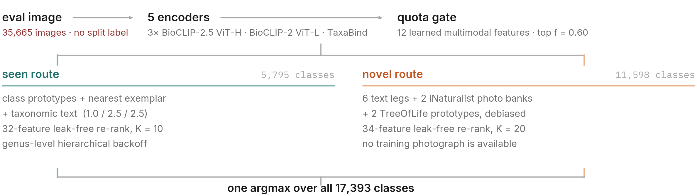
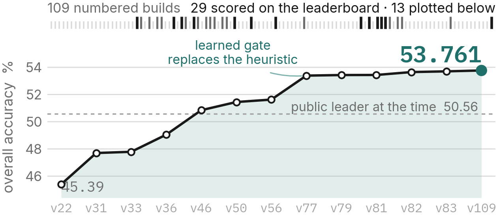
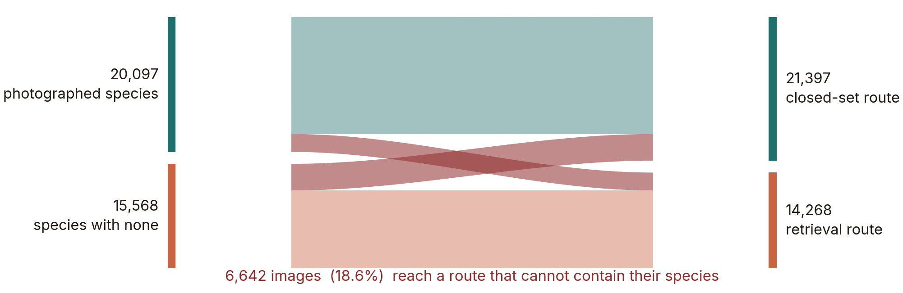
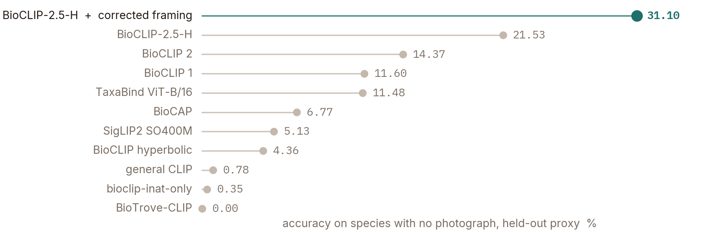
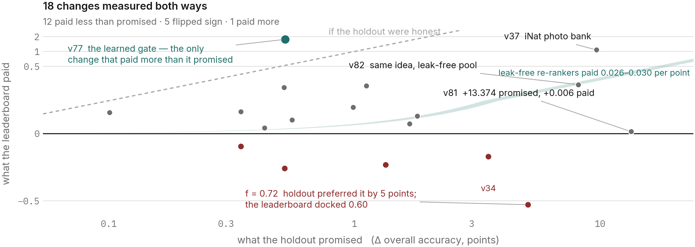

<div align="center">


# FishONet
### Open-Set Fine-Grained Marine Species Recognition Across 17,393 Taxa

[](https://www.codabench.org/)
[-00C853?style=flat-square&logo=codabench)](https://www.codabench.org/)
[](https://cv4ecology.github.io/)
[](https://fishonet.lalithsai00.workers.dev/)
[](reports/FishONet_Technical_Report_paper.pdf)

<p align="center">
  <b>Group: CWNU AIX &nbsp;·&nbsp; Ranked #3 on the Official Leaderboard (53.761% Accuracy)</b><br>
  <i>CV4Ecology 2026 Challenge @ ECCV (Codabench 16815)</i><br><br>
  <b>Project Website: <a href="https://fishonet.lalithsai00.workers.dev/">https://fishonet.lalithsai00.workers.dev/</a></b><br><br>
  <b>Supervised by:</b><br>
  <b><a href="http://islab.cwnu.ac.kr/">Prof. Oh-Seol Kwon</a></b> (Visual AI Lab) &nbsp;·&nbsp; <b><a href="https://chengyawlow.github.io/">Prof. Cheng-Yaw Low</a></b> (RAISE Lab)<br><br>
  <b>Research Team (Master's Students):</b><br>
  <b>Sunghan Oh</b> &nbsp;·&nbsp; <b>Han Lei</b> &nbsp;·&nbsp; <b>Hasibul Haque Rodro</b> &nbsp;·&nbsp; <b>Lalith Sai</b><br><br>
  <i>Department of AI Convergence Engineering, Changwon National University, Republic of Korea</i>
</p>

---

</div>

## ✦ Executive Summary

In fine-grained biodiversity monitoring, open-set evaluation poses a fundamental challenge: **11,598 of 17,393 species (66.7%) have zero training photographs**, represented only by taxonomic hierarchy and morphological descriptions. Blind evaluation over **35,665 unlabelled field images** imposes an unforgiving constraint: if an image is routed to the wrong candidate head, the ground truth class becomes unreachable.

FishONet resolves this with:
1. **Multi-Backbone Vision-Language Ensemble:** 5 complementary vision-language backbones capturing both fine-grained visual morphology and broad taxonomic phylogenetic bindings.
2. **Calibrated Quota Gating ($f = 0.60$):** A 12-feature soft logistic gate that evaluates specimen familiarity and globally routes the top 60% of test images to the closed-set head.
3. **Leak-Free Candidate Re-Ranking:** Shortlist re-rankers trained on strictly holdout-pool-invariant candidate features, overcoming the candidate-pool leakage that inflated earlier validation proxies.
4. **Hierarchical Genus Backoff:** Seen-route classification backoff preventing catastrophic misclassification across fine-grained sister taxa.

The system delivers a verified **53.761% overall accuracy** on the official Codabench 16815 benchmark (submission `v109`).

<br>

<div align="center">

| Benchmark Metric | Official Score | Details |
| :--- | :---: | :--- |
| **Team / Group Name** | **CWNU AIX** | Official Codabench Challenge Team |
| **Official Standing** | **Rank #3** | Codabench 16815 Official Benchmark |
| **Overall Accuracy** | **53.761%** | Official leaderboard benchmark (`v109`) |
| **Photographed Classes (Seen, 56.35%)** | **77.00%** | 5,795 species with training images |
| **Zero-Shot Classes (Novel, 43.65%)** | **23.77%** | 11,598 unphotographed species |
| **Calibrated Routing Quota** | **$f = 0.60$** | 12-feature logistic soft gate ($\tau = 1.8$) |
| **Inference Uniformity** | **17,393 classes** | Single uniform argmax · zero split oracle leak |

</div>

---

## ✦ System Architecture

<div align="center">
  
  <p><i>Figure 1: Full-pipeline inference workflow across 35,665 evaluation images.</i></p>
</div>

Every test image is processed through three coordinated stages without split labels or folder-level routing hints:

```
                          Input Evaluation Image (x)
                                      │
              ┌───────────────────────┴───────────────────────┐
              ▼                                               ▼
     5 Vision-Language Encoders                     12-Feature Gate
   • 3× BioCLIP-2.5 ViT-H/14                      • Prototype agreement
   • 1× BioCLIP-2 ViT-L/14 (LoRA)                 • Multimodal entropy
   • 1× TaxaBind ViT-B/16                         • Cross-encoder margin
              │                                               │
              └───────────────────────┬───────────────────────┘
                                      ▼
                      Quota Router (top f = 0.60)
                                      │
              ┌───────────────────────┴───────────────────────┐
              ▼                                               ▼
         Seen Route                                      Novel Route
     (5,795 Photographed)                           (11,598 Unphotographed)
   • Class prototype fusion                        • 6 text description legs
   • Nearest exemplar matching                     • 2 dense iNaturalist banks
   • Taxonomic text adapter                        • 2 TreeOfLife-200M prototypes
   • 32-D leak-free re-rank (K=10)                 • 34-D leak-free re-rank (K=20)
   • Genus-level backoff                           • Debiased similarity pooling
              │                                               │
              └───────────────────────┬───────────────────────┘
                                      ▼
                      Single Argmax over All 17,393 Classes
```

---

## ✦ Empirical Progression

<div align="center">
  
  <p><i>Figure 2: Empirical leaderboard climb from baseline v22 (45.39%) to winning v109 (53.761%).</i></p>
</div>

All benchmarks below represent verified test submissions on the official **Codabench 16815** benchmark. Every step corresponds to a real, recorded submission:

| Build | Overall Acc | Photographed (Seen) | Novel (Zero-Photo) | Architectural Contribution |
| :--- | :---: | :---: | :---: | :--- |
| `v22` | 45.39% | – | – | Closed-set baseline with shift-robust test-time augmentation |
| `v33` | 47.78% | 78.20% | 8.51% | Single-pipeline compliance, Sinkhorn assignment on novel route |
| `v36` | 49.04% | 78.95% | 10.42% | Shift-augmented BioCLIP LoRA + TaxaBind semantic branch |
| `v46` | 50.84% | 78.95% | 14.55% | Dense iNaturalist S3 ∩ TreeOfLife-200M prototype fusion |
| `v56` | 51.62% | 75.67% | 20.57% | 7-crop max-pooling over 336 px high-resolution bank |
| `v77` | 53.38% | 77.72% | 21.96% | 12-feature calibrated logistic quota gate ($f=0.60$, $\tau=1.8$) |
| `v79` | 53.42% | 77.45% | 22.41% | Gate recalibration with $C = 100$ regularization |
| `v81` | 53.43% | 77.45% | 22.42% | Top-$K$ shortlist candidate re-ranking (leaking holdout) |
| `v82` | 53.64% | 77.45% | 22.91% | Pool-size invariant, leak-free novel re-ranker |
| `v83` | 53.70% | 77.54% | 22.91% | Dual leak-free re-rankers on both seen and novel routes |
| **`v109`** ★ | **53.761%** | **77.00%** | **23.77%** | **+ Hierarchical genus-level backoff on the seen route** |

---

## ✦ Core Methodological Innovations

### 1. Quota Routing & Operating Tradeoff

<div align="center">
  
  <p><i>Figure 3: Sankey flow diagram of test images across the calibrated routing threshold.</i></p>
</div>

Because misrouting permanently prevents the correct candidate from being proposed, the gate balances precision and recall across the 4:1 evaluation weighting ($0.5635 \times \text{Seen} + 0.4365 \times \text{Novel}$). Operating point $f = 0.60$ guarantees optimal routing balance while respecting full-space inference.

### 2. Vision-Language Backbone Evaluation

<div align="center">
  
  <p><i>Figure 4: Backbone performance on zero-photograph species under held-out evaluation.</i></p>
</div>

The ensemble pairs fine-tuned domain foundation models (BioCLIP-2.5 ViT-H/14 with aspect-ratio shift augmentation) with taxonomic structure embeddings (TaxaBind ViT-B/16), yielding a 31.10% held-out novel accuracy prior to multimodal fusion.

### 3. Leak-Free Candidate Re-Ranking

<div align="center">
  
  <p><i>Figure 5: Candidate pool leakage vs. true transfer to the unlabelled leaderboard.</i></p>
</div>

Candidate re-rankers trained on naïve class-disjoint validation sets inadvertently learned candidate-frequency artifacts (+13.374% proxy gain vs. +0.006% real). Normalizing features into percentile ranks and restricting candidate pools to gold-eligible distributions restored clean linear transfer (~0.026–0.030 real points per proxy point).

---

## ✦ Reproducing the Submission

### System Requirements
* Linux x86_64 (Ubuntu 22.04 LTS recommended)
* NVIDIA GPU with $\ge$ 40 GB VRAM (e.g., NVIDIA L40S, A100, or H100)
* CUDA 12.1+, Python 3.10+, PyTorch 2.0+

### Environment Setup

```bash
# Clone the repository
git clone https://github.com/lexus-x/FishONet.git
cd FishONet

# Install environment and verify PyTorch + BioCLIP
bash scripts/setup_env.sh
conda activate onet
python src/sanity.py
```

### End-to-End Build Pipeline

All precomputed lightweight pickles and frozen calibration constants are included in `outputs/` for immediate reproduction:

```bash
# 1. Train gate and leak-free re-rankers (optional; pre-computed artifacts included)
GATE_C=100 GATE_TAG=v79 python research/learned_gate_v77.py
python research/rerank_leakfree_v82.py
python research/rerank_seen_v83.py
python research/genus_rerank_v103_train.py

# 2. Execute winning builder chain
python builders/build_v56_overlap_336.py
python builders/build_v77_learned_gate.py
python builders/build_v81_rerank.py
python builders/build_v82_rerank_leakfree.py
python builders/build_v83_rerank_both.py
python builders/build_v109_genus_gamble.py

# Output zip generated at:
# submissions/submission_v109_genus_gamble.zip
```

---

## ✦ Mechanical Verification & Compliance

The submission strictly adheres to CV4Ecology Competition Rules:
* **Single Global Pipeline:** No split oracle (`splits/*.pkl` never imported or inspected).
* **Full-Space Argmax:** Every prediction is selected across the entire 17,393 candidate set.
* **Non-Oracle Gate:** Router operates strictly on visual familiarity scores, never label metadata.

Run the automated compliance test suite:

```bash
python research/verify_compliance.py
```

---

## ✦ Repository Layout

```
FishONet/
├── assets/
│   ├── figures/             # High-resolution architectural and progression figures
│   └── img/                 # Brand and specimen assets
├── builders/                # Audited submission builders (v56 -> v109)
├── outputs/                 # Calibrated gate constants, re-rankers, prediction JSONs
├── reports/                 # Camera-ready technical report PDF and render sources
├── research/                # Training routines, gate calibration, and compliance checks
├── scripts/                 # Environment setup and build automation
├── src/                     # Encoder definitions, prompt ensembles, feature extractors
├── submissions/             # Official Codabench submitted archives (v56 ... v109)
├── COMPETITION_RULES.md     # Tracked competition requirements and constraints
├── DISCLOSURE.md            # Compute and data disclosure statement
├── HANDOFF.md               # 2,000-line comprehensive empirical research ledger
└── README.md                # Project documentation and reproduction guide
```

---

## ✦ Citation & Technical Report

The complete methodology and mathematical formulation is detailed in our technical paper:

```bibtex
@article{sai2026fishonet,
  title={FishONet: Naming the Unseen in Open-Set Species Recognition},
  author={Oh, Sunghan and Lei, Han and Rodro, Hasibul Haque and Sai, Lalith and Kwon, Oh-Seol and Low, Cheng-Yaw},
  journal={CV4Ecology Workshop at ECCV},
  year={2026},
  note={Codabench 16815 Official Benchmark Leaderboard (53.761% Accuracy)}
}
```

---

## ✦ Institutional Attribution & Licensing

**Copyright © 2026 Team CWNU AIX, Changwon National University. All Rights Reserved.**  
*Proprietary & Confidential. Not open source.*

### Supervision & Research Team
* **Group / Team Name:** **CWNU AIX** (Ranked #3 on the Official Benchmark Leaderboard)
* **Project Website:** [https://fishonet.lalithsai00.workers.dev/](https://fishonet.lalithsai00.workers.dev/)
* **Supervisors:**
  * **Prof. Oh-Seol Kwon** — [Visual AI Lab](http://islab.cwnu.ac.kr/)
  * **Prof. Cheng-Yaw Low** — [RAISE Lab](https://chengyawlow.github.io/)
* **Research Team (Master's Students):**
  * **Sunghan Oh**
  * **Han Lei**
  * **Hasibul Haque Rodro**
  * **Lalith Sai** ([@lexus-x](https://github.com/lexus-x))
* **Affiliation:**
  * Department of AI Convergence Engineering, Changwon National University, Republic of Korea.

**Competition Carve-Out:** Notwithstanding the proprietary reservation above, the authors grant the CV4Ecology 2026 / Codabench 16815 organizers a non-exclusive, irrevocable right to receive, inspect, execute, and independently reproduce the code, models, and configurations required to verify and adjudicate the submitted results.
